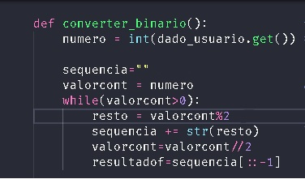
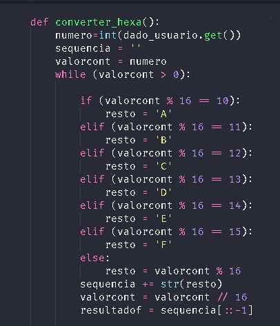
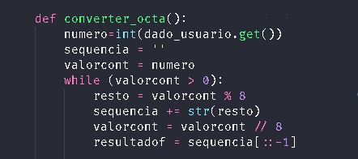
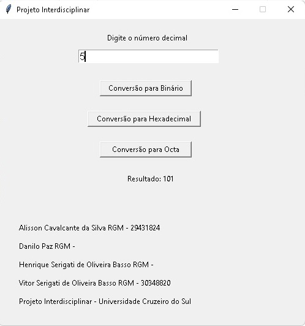
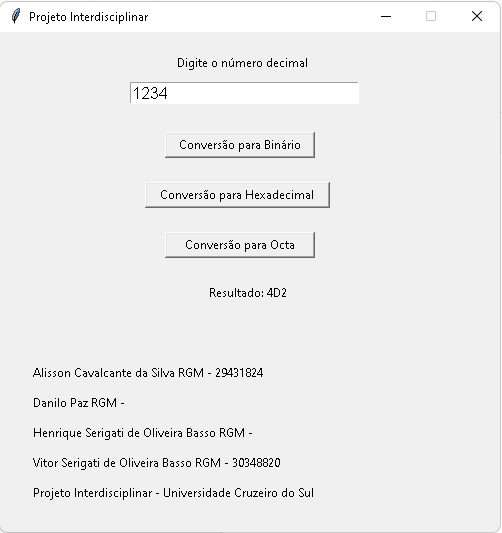
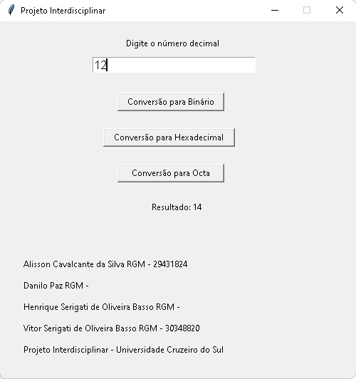

# Decon
---
- [x] Projeto interdisciplinar que visa unir as matérias de Organização e Arquitetura de computadores e também Programação de computadores. 

- [x] O projeto consiste em criar um programa que possa fazer as conversões da base decimal para as bases binária, hexadecimal e octal.
    
Proposto pelo curso de Análise e Desenvolvimento de Sistemas da Universidade Cruzeiro do Sul

---

## Conteúdo:
- [x] O programa conta com uma interface e botões que servirão como menu, onde pode-se escolher a base para a qual o usuário deseja converter o número que ele mesmo irá digitar.

- [x] O programa deverá, então, fazer os cálculos necessários para que seja apresentado ao usuário.

---

## Linguagem utilizada:

- Python -versão- 3.10

---

## Criadores:
|Nome dos Alunos: | RGM:             |
|-----------------|------------------|
|Vitor Serigati de Oliveira Basso| 30348820   |
|Henrique Serigati de Oliveira Basso| |
|Alisson Cavalcante da Silva| 29431824        |
|Danilo Paz|                          |
   
---

## Versão do Sistema:

- 2.0

# Exemplos de funcionamento do programa:

* Função que converterá o valor digitado em binário ->

* Função que converterá o valor digitado em Hexadecimal ->

* Função que converterá o valor digitado em Octal ->

- Janela da conversão em Binário

- Janela da conversão em Hexadecimal

- Janela da conversão em Octal

